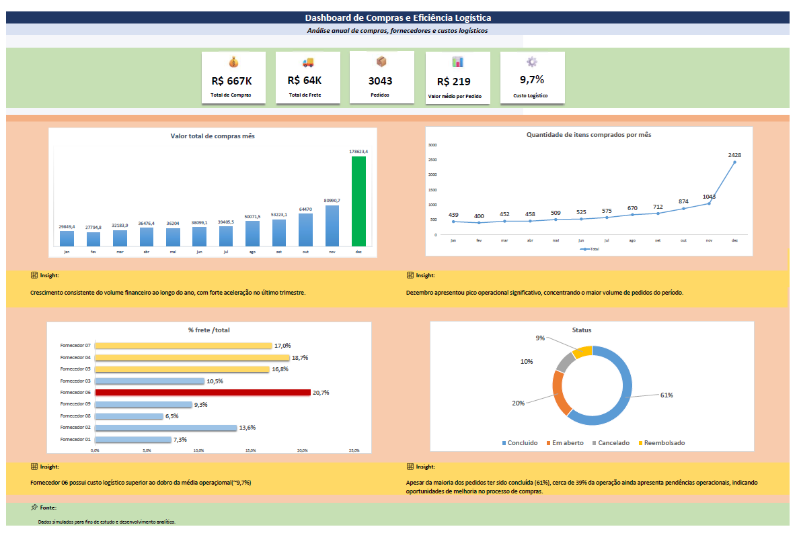
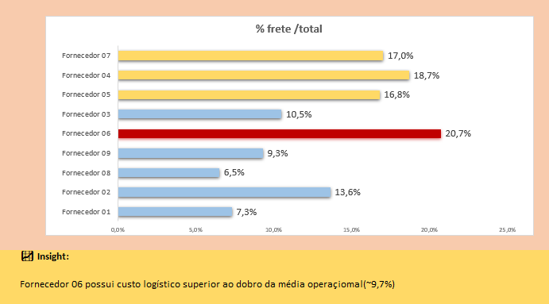
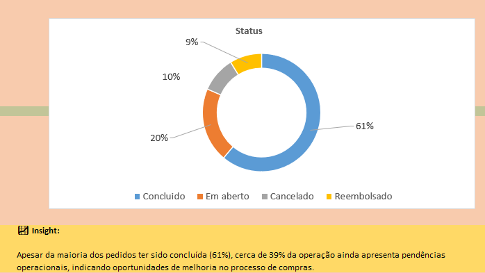

# 📊 Purchase & Logistics Operational Analysis

## 📌 Overview

This project presents a business-focused purchasing and logistics analysis developed in Excel, aimed at identifying operational bottlenecks, supplier inefficiencies, freight cost impacts, and optimization opportunities.

The project combines KPI monitoring, temporal trends, logistics evaluation, Pareto analysis, and operational indicators to support data-driven decision-making.

---

# 🎯 Business Objectives

- Monitor purchasing performance over time
- Identify logistics inefficiencies
- Evaluate supplier operational performance
- Detect operational bottlenecks
- Support strategic purchasing decisions
- Improve visibility into logistics costs

---

# 📊 Executive Dashboard



The dashboard provides an executive overview of purchasing operations, logistics efficiency, and operational status.

---

# 🚚 Logistics Efficiency



The logistics evaluation identified significant variations in freight cost efficiency between suppliers.

### Key Findings
- Supplier 06 presented freight costs significantly above the operational average
- Logistics costs varied substantially across suppliers
- The analysis revealed opportunities for supplier and freight optimization

---

# 📦 Operational Status



The operational status indicators highlight the overall health of the purchasing workflow.

### Key Findings
- Most orders were successfully completed
- Open orders represent a significant operational volume
- Cancellation and refund rates indicate opportunities for process improvement

---

# 📈 Operational Insights

The analysis identified:

- Strong operational growth during the final quarter
- Significant increase in purchasing demand in December
- Supplier logistics inefficiencies
- Operational bottlenecks in open orders
- Freight cost variation across suppliers and regions
- Strategic concentration of products through Pareto analysis

---

# 📊 Main KPIs

| KPI | Value |
|---|---|
| Total Purchases | R$ 667K |
| Total Freight Cost | R$ 64K |
| Total Orders | 3,043 |
| Average Order Value | R$ 219 |
| Logistics Cost | 9.7% |

---

# 🛠 Tools & Techniques

- Microsoft Excel
- Pivot Tables
- KPI Monitoring
- Dynamic Charts
- Conditional Formatting
- Pareto Analysis (ABC Curve)
- Operational Analysis
- Logistics Performance Evaluation

---

# 🚀 Business Value

This project demonstrates how operational purchasing data can be transformed into actionable business insights to support:

- Cost reduction initiatives
- Logistics optimization
- Supplier performance evaluation
- Operational efficiency improvements
- Strategic decision-making

---

# 📂 Project Structure

```plaintext
purchase-analysis-dashboard-excel/
│
├── data/
│   └── purchase_data.xlsx
│
├── images/
│   ├── dashboard-main.png
│   ├── logistics-analysis.png
│   └── operational-status.png
│
├── docs/
│   └── analysis-report.pdf
│
├── README.md
└── LICENSE
```

---

# 📌 About the Project

This project was developed as part of a data analytics portfolio focused on operational analysis, business intelligence, and data visualization using Excel-based solutions.

---

# ⚠️ Disclaimer

This project uses simulated data for educational and portfolio purposes.

---

# 👩‍💻 Author

Lania Barros

Data Analysis | Business Intelligence | Data Visualization

- Excel
- SQL
- Python
- Power BI
- Machine Learning

GitHub: https://github.com/lanbg
